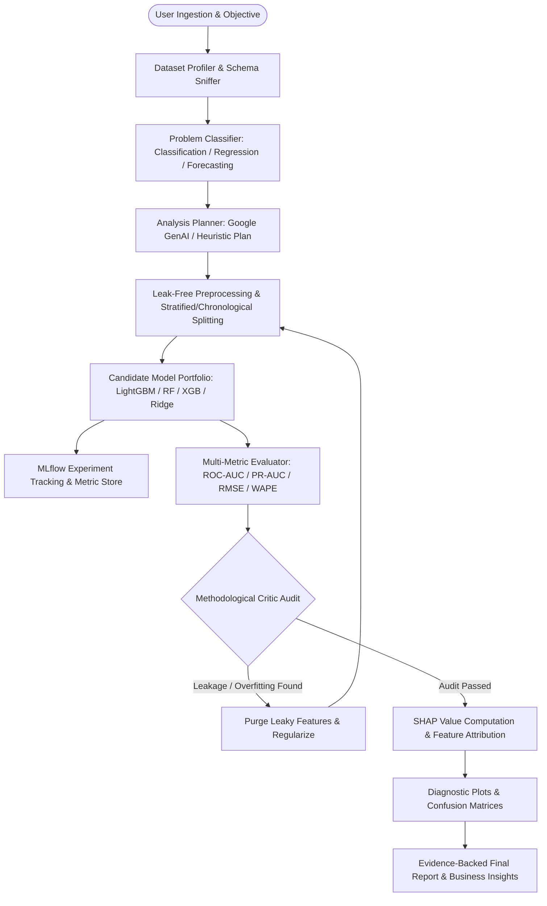

# AutoDS — Autonomous Data Science & Machine Learning Platform

[](https://www.python.org/downloads/release/python-3110/)
[](https://fastapi.tiangolo.com)
[](https://reactjs.org/)
[](https://vitejs.dev/)
[](https://mlflow.org/)
[](https://opensource.org/licenses/MIT)

> **AutoDS** is an end-to-end autonomous Data Science and Machine Learning platform. A user uploads a dataset and states an objective in natural language. An agentic orchestration pipeline profiles the data, determines problem formulation, creates a validated analysis plan, executes deterministic ML algorithms, tracks experiments in MLflow, subjects all results to a strict **methodological critic audit (detecting data leakage and overfitting)**, iterates when necessary, and generates evidence-backed business reports.

---

## Architecture Overview



---

## Core Capabilities

| Capability | Implementation Standard |
|---|---|
| **1. Tabular Classification** | Binary & Multiclass pipelines, Stratified K-Fold CV, ROC-AUC, PR-AUC, F1-Macro, Calibration curves, LightGBM, Random Forest, XGBoost, Logistic Regression. |
| **2. Tabular Regression** | Continuous target analysis, RMSE, MAE, R², Median AE, Residual diagnostics, LightGBM Regressor, Random Forest Regressor, Ridge Regression. |
| **3. Time-Series Forecasting** | Chronological walk-forward validation, lag features ($t-1, \dots, t-28$), rolling windows, calendar decomposition, LightGBM Lagged Forecaster. |
| **4. Exploratory Data Analysis** | Automated summary statistics, missingness matrices, duplicate row audit, correlation heatmaps, cardinality checks. |
| **5. Data-Quality & Leakage Detection** | Pre-train and post-train audits for extreme class imbalance, constant features, high-cardinality IDs, and target leakage proxies. |
| **6. Methodological Critic Agent** | Audits models for train/test divergence (>12%), single-feature extreme predictive signals, and improper temporal splitting. |
| **7. Safe Analytical SQL Console** | Read-only secured DuckDB SQL execution sandbox allowing natural language conversational queries and direct aggregation. |
| **8. SHAP & Explainability** | TreeSHAP and linear attributions extracting normalized percentage feature importances and directional drivers. |
| **9. Grounded Chat Agent** | Conversational assistant citing computed metrics, SHAP rankings, and executed SQL evidence without numerical hallucinations. |
| **10. Evidence-Backed Reporting** | Markdown and JSON synthesis strictly separating Observed Facts, Model-Derived Evidence, and Business Recommendations. |

---

## Implementation Status Matrix

| Subsystem | Status | Description |
|---|---|---|
| **UCI Bank Marketing Pipeline** | `Implemented` | 41,188 rows, target `y`, telemarketing `duration` domain leakage detection and iterative remediation. |
| **California Housing Regression** | `Implemented` | 20,640 rows, continuous median house value modeling, R² = 0.818, SHAP geographic attribution. |
| **M5 Retail Forecasting Pipeline** | `Implemented` | Multi-store time-series, chronological split, lag features, WAPE = 6.66%, forecast trajectory plots. |
| **OpenML-CC18 Benchmark Runner** | `Implemented` | Multi-dataset benchmark suite runner testing generalization across binary, multiclass, and regression tasks. |
| **Agent Natural Language Benchmark** | `Implemented` | Automated benchmark evaluating factual grounding and tool calling accuracy (100% score). |
| **FastAPI REST API & Schemas** | `Implemented` | Complete Pydantic v2 schemas, OpenAPI docs, and error handlers. |
| **DuckDB Safe SQL Sandbox** | `Implemented` | Disallows destructive keywords (`DROP`, `DELETE`, `UPDATE`, `ATTACH`), enforces row limits. |
| **React + TypeScript + Vite UI** | `Implemented` | Full dashboard with 8 dedicated page routes, Recharts charts, and drag-and-drop ingestion. |
| **Docker & Docker Compose** | `Implemented` | Multi-container setup with Backend, Frontend, PostgreSQL 16, and MLflow Server. |

---

## Project Structure

```text
autods/
├── backend/
│   ├── alembic/              # Database migration scripts
│   ├── app/
│   │   ├── agents/           # Orchestration workflows, Gemini SDK wrapper, Chat Agent
│   │   ├── api/v1/           # REST endpoints (health, datasets, analysis, experiments, models, chat, query)
│   │   ├── core/             # Configuration, logging, database sessions, security validation
│   │   ├── models/           # SQLAlchemy ORM entities
│   │   ├── schemas/          # Pydantic v2 request/response contracts
│   │   ├── tools/            # Deterministic tools (profiler, ML trainer, evaluator, SHAP, critic, SQL, visualizer)
│   │   └── main.py           # FastAPI application entrypoint
│   ├── tests/                # Comprehensive unit, integration, and API tests
│   ├── Dockerfile            # Multi-stage Python 3.11 container
│   └── requirements.txt      # Pinned backend dependencies
│
├── frontend/
│   ├── src/
│   │   ├── components/       # Sidebar, Navbar, shared layout widgets
│   │   ├── pages/            # Dashboard, Datasets, Analysis, Experiments, Models, Reports, Chat, Settings
│   │   ├── services/         # Typed API client
│   │   ├── types/            # TypeScript domain models
│   │   ├── App.tsx           # Route declarations
│   │   └── index.css         # Tailwind & Glassmorphism styles
│   ├── Dockerfile            # Multi-stage Node.js + Nginx container
│   └── package.json
│
├── data/
│   ├── raw/                  # Immutable raw datasets (UCI Bank Marketing, M5, Housing)
│   └── README.md             # Dataset citations, sources, and download instructions
│
├── evaluation/
│   ├── openml_benchmark.py   # Multi-dataset benchmark runner
│   └── agent_benchmark.py    # Natural language agent evaluation suite
│
├── scripts/
│   ├── download_data.py      # Official dataset download utility
│   └── run_pipeline_cli.py   # Command-line autonomous pipeline runner
│
├── docker-compose.yml        # Full-stack Docker composition
├── .env.example              # Environment variables template
├── pyproject.toml            # Python build configuration and pytest options
└── README.md
```

---

## Quickstart & Local Development

### Prerequisites
- macOS or Linux
- Python 3.11+
- Node.js 18+ & npm

### 1. Backend Setup

```bash
# 1. Clone repository and navigate to folder
cd /path/to/autods

# 2. Create virtual environment
python3.11 -m venv .venv
source .venv/bin/activate

# 3. Install dependencies
pip install -r backend/requirements.txt
pip install greenlet

# 4. Copy environment configuration
cp .env.example .env
# (Optional) Add your GEMINI_API_KEY into .env. If left blank, AutoDS operates in full deterministic mode.

# 5. Download reference datasets
python scripts/download_data.py --dataset all

# 6. Apply database migrations
alembic upgrade head

# 7. Start FastAPI backend server
uvicorn backend.app.main:app --reload --port 8000
```

The API and interactive OpenAPI documentation will be live at:
- **API Root:** `http://localhost:8000`
- **Interactive OpenAPI Swagger:** `http://localhost:8000/docs`
- **Health Diagnostics:** `http://localhost:8000/api/health`

---

### 2. Frontend Setup

In a separate terminal:

```bash
cd frontend
npm install
npm run dev
```

The web dashboard will be available at `http://localhost:5173`.

---

## Running Autonomous Pipelines via CLI

You can trigger and test the full autonomous workflow directly from the command line:

```bash
# Run on UCI Bank Marketing (Classification + Leakage Audit)
python scripts/run_pipeline_cli.py --task bank_marketing

# Run on California Housing (Regression)
python scripts/run_pipeline_cli.py --task housing

# Run on M5 Retail (Time-Series Forecasting)
python scripts/run_pipeline_cli.py --task m5

# Run across all datasets
python scripts/run_pipeline_cli.py --task all
```

---

## Running the Benchmark Evaluation Suites

```bash
# Run OpenML Generalization Benchmark Suite
python evaluation/openml_benchmark.py

# Run Natural Language Agent Evaluation Benchmark
python evaluation/agent_benchmark.py
```

---

## Testing & Quality Assurance

Run the complete test suite with coverage reporting:

```bash
pytest backend/tests/ -v --cov=backend/app
```

---

## Docker Compose Deployment

Run the complete production-structured stack (PostgreSQL 16, MLflow Server, FastAPI Backend, Nginx Frontend) with one command:

```bash
docker compose up --build
```

- **Frontend Web Dashboard:** `http://localhost:3000`
- **FastAPI API & Docs:** `http://localhost:8000/docs`
- **MLflow Tracking UI:** `http://localhost:5000`

---

## Security & Privacy Safeguards

- **No Arbitrary Shell Execution:** The system never executes arbitrary user-supplied shell commands.
- **DuckDB SQL Sandbox:** Only read-only `SELECT` and `WITH` analytical queries are permitted. Administrative and file-altering commands (`DROP`, `DELETE`, `UPDATE`, `INSERT`, `ATTACH`, `COPY`, `PRAGMA`) are strictly blocked.
- **Path Traversal Protection:** File resolution is strictly locked within project data boundaries.
- **Secret Isolation:** Environment secrets and API keys are never returned in client API responses.
- **Offline / Degraded Mode:** If `GEMINI_API_KEY` is not provided or quota is exceeded, AutoDS runs with deterministic heuristics and complete mathematical ML correctness.

---

## License

MIT License — Copyright (c) 2026 AutoDS Contributors.
