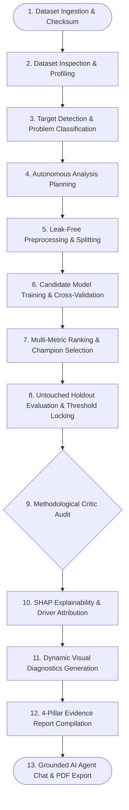

# AutoDS — Autonomous Evidence-Driven Data Science Platform

[](https://www.python.org/downloads/release/python-3110/)
[](https://fastapi.tiangolo.com)
[](https://reactjs.org/)
[](https://vitejs.dev/)
[](https://mlflow.org/)
[](https://github.com)
[](https://opensource.org/licenses/MIT)

> **AutoDS** is an autonomous, evidence-driven data science platform that takes a dataset from profiling and data-quality auditing through model selection, validation, explainability, business insights, and grounded AI-assisted analysis.

---

## Overview

AutoDS is designed to bridge the gap between raw data ingestion and rigorous, production-grade Data Science analysis. When a user uploads a tabular dataset and specifies a high-level goal, AutoDS autonomously profiles the schema, identifies data-quality anomalies (missingness, duplicate rows, constant columns), determines the appropriate predictive problem type, applies fold-safe leak-free preprocessing, benchmarks candidate machine learning algorithms using cross-validation, selects a champion model, evaluates it against an untouched holdout partition, conducts a rigorous methodological critic audit, extracts SHAP explainability drivers, generates dataset-appropriate visual diagnostics, and compiles a comprehensive 4-pillar evidence-backed report with a grounded conversational AI assistant.

---

## Why AutoDS?

Traditional AutoML tools often treat machine learning as an unconstrained optimization benchmark—frequently training directly on leaky features, reporting overfitted metrics on contaminated validation splits, or using default 0.5 decision thresholds on highly imbalanced data.

AutoDS enforces **scientific methodology over vanity metrics**:
1. **Zero Data Leakage:** Preprocessing transformations (imputation, scaling, one-hot encoding) are fitted strictly on training partitions and never peek at holdout test sets.
2. **Untouched Holdout Sets:** Model selection and threshold tuning are locked using Out-of-Fold (OOF) cross-validation; the final holdout test set is evaluated exactly once.
3. **Methodological Critic Audits:** Built-in critic rules actively audit for generalization gaps, single-feature dominance, and target leakage proxies before synthesizing reports.
4. **Non-Causal Statistical Grounding:** Model importance rankings (TreeSHAP/Linear attributions) are explicitly labeled as predictive statistical signals rather than causal claims.
5. **Grounded AI Interaction:** The integrated AI Assistant does not make unverified claims; it is grounded directly in the computed numerical metrics and findings of the AutoDS engine.

---

## Key Features

- **Automatic Dataset Profiling:** Cryptographic SHA-256 integrity hashing, delimiter sniffing, column type classification, missingness matrices, and duplicate row detection.
- **Automatic Target & Task Classification:** Heuristically detects candidate target columns, cardinality, temporal ordering, and classifies problems into Binary Classification, Multiclass Classification, Regression, or Time-Series Forecasting.
- **Leak-Free Preprocessing:** Fold-safe data transformations, robust median imputation, categorical encoding, and chronological temporal alignment.
- **Candidate Model Portfolio:** Trains and compares diverse algorithmic paradigms (LightGBM, XGBoost, Random Forest, Logistic/Ridge Regression, and Dummy Baselines).
- **Stratified Cross-Validation:** Multi-metric ranking across folds to determine champion models without touching test data.
- **Touchless Holdout Evaluation:** Validates the locked champion model against an untouched holdout test partition.
- **Threshold Optimization:** F1-optimal, precision-constrained, and cost-weighted decision threshold optimization on out-of-fold predictions for imbalanced classification.
- **Methodological Critic Auditor:** Flags train-test divergence, severe overfitting, high-cardinality leakage proxies, and invalid validation splits.
- **SHAP & Feature Explainability:** Multi-dimensional TreeSHAP and linear coefficients with non-causal statistical interpretations.
- **Dynamic Visual Diagnostics:** Generates problem-specific, high-resolution diagnostic plots (ROC Curves, PR Curves, Confusion Matrices, Residual Plots, Actual vs Predicted/Forecast Trajectories).
- **4-Pillar Evidence Synthesis:** Structured reports dividing findings into *Observed Facts*, *Model-Derived Evidence*, *Actionable Recommendations*, and *Causal Limitations*.
- **Grounded AI Agent Chat:** Context-aware interactive assistant grounded in actual dataset schemas, run IDs, champion metrics, and audit findings.
- **Client-Side PDF Export:** High-fidelity multi-page PDF generation of structured analytical reports.

---

## System Architecture



---

## Supported Analysis Types

| Analysis Type | Validation Strategy | Primary Evaluation Metrics | Champion Model Portfolio |
|---|---|---|---|
| **Binary Classification** | Stratified $K$-Fold CV + Holdout | ROC-AUC, PR-AUC, F1-Score, Balanced Accuracy, Log-Loss | LightGBM, XGBoost, Random Forest, Logistic Regression, Dummy Baseline |
| **Multiclass Classification** | Stratified $K$-Fold CV + Holdout | Macro ROC-AUC, Macro PR-AUC, Accuracy, Macro F1 | LightGBM, Random Forest, Logistic Regression (One-vs-Rest) |
| **Regression** | $K$-Fold CV + Holdout | RMSE, MAE, $R^2$, Median Absolute Error | LightGBM Regressor, Random Forest Regressor, Ridge Regression |
| **Time-Series Forecasting** | Chronological Walk-Forward Split | RMSE, MAE, WAPE, MAPE | LightGBM Lagged Forecaster (Lags $t-1 \dots t-28$, Rolling Statistics) |

---

## Validation Philosophy

AutoDS follows rigorous statistical and machine learning best practices:

1. **Training vs Validation vs Holdout:**
   - **Training Folds:** Used exclusively to fit candidate model estimators and preprocessing transformers.
   - **Validation Folds (OOF):** Used exclusively for hyperparameter tuning, model comparison, and optimal decision threshold selection.
   - **Holdout Test Set:** Remains untouched throughout the entire model comparison phase and is evaluated exactly once after the champion model is locked.
2. **Why Accuracy Alone Is Insufficient:**
   - On imbalanced datasets (e.g., 5% positive class prevalence), a naive baseline achieves 95% accuracy while offering zero predictive utility. AutoDS calculates prevalence-aware Precision-Recall AUC (PR-AUC), Balanced Accuracy, and optimal decision thresholds.
3. **Why SHAP Is Not Causal:**
   - Feature attribution values (SHAP) measure the statistical contribution of a feature to the model's output given observational associations. They do not demonstrate that intervening on a feature will causally alter real-world outcomes. AutoDS explicitly annotates all feature attribution outputs with non-causal disclosures.

---

## Dynamic Visual Diagnostics

AutoDS dynamically synthesizes high-resolution diagnostic plots tailored to the mathematical task:

- **Classification:**
  - **ROC Curve:** Binary single-curve or Multiclass One-vs-Rest (OvR) per-class curves with Macro-Average ROC-AUC and chance baseline.
  - **Precision-Recall Curve:** Macro-average and per-class PR curves with empirical class prevalence reference baseline.
  - **Confusion Matrix:** Integer count matrix with explicit class labels evaluated on the untouched holdout test partition.
  - **Top Predictive Drivers:** Ranked percentage feature importances derived from TreeSHAP or linear weights.
- **Regression:**
  - **Actual vs Predicted Scatter:** Calibration plot with $45^\circ$ perfect-prediction reference line.
  - **Residual Diagnostics:** Two-panel figure with Residuals vs Predicted and Residual Error Distribution histogram.
  - **Top Predictive Drivers:** Feature attribution rankings.
- **Forecasting:**
  - **Actual vs Forecast Horizon:** Sequential temporal trajectory comparing actual time series to model forecast.
  - **Forecast Error Diagnostics:** Chronological residual distribution.
  - **Top Predictive Drivers:** Lag and calendar feature importances.

---

## Grounded AI Agent Chat

The conversational AI Assistant in AutoDS uses Google Gemini (`gemini-3.1-flash-lite`) not as a standalone predictive model, but as a **grounded scientific analysis assistant**.

When answering questions, the agent is provided with the verified computed artifacts of the active run:
- Exact dataset dimensions and cryptographic checksums
- Data quality findings and duplicate row metrics
- Cross-validation leaderboard and champion selection criteria
- Touchless holdout metrics and locked decision thresholds
- Methodological critic findings and potential leakage remediations
- SHAP predictive driver percentages

This ensures the agent explains *actual computed evidence* rather than generating hallucinated metrics.

---

## Representative Dataset Example: Wine Quality Red

To illustrate the dataset-agnostic pipeline, consider `winequality-red.csv` (1,599 rows $\times$ 12 attributes):

1. **Target Detection:** Automatically identifies `quality` as the target column without manual configuration.
2. **Task Classification:** Categorizes the problem as multiclass classification (quality ratings 3 through 8).
3. **Data Quality Audit:** Detects 240 duplicate rows and flags class imbalance in extreme rating bands (3 and 8).
4. **Model Benchmarking:** Evaluates candidate models across 5-Fold Stratified Cross-Validation.
5. **Champion Selection:** Selects `LogisticRegression` (CV Macro-AUC: 0.8008, Holdout Accuracy: 0.5809, Holdout Macro-AUC: 0.7821, Macro PR-AUC: 0.3724).
6. **Critic Audit:** `STATUS: PASSED` (Zero target leakage detected, fold-isolated preprocessing verified).
7. **Predictive Drivers:** Identifies `alcohol` (24.3%), `volatile acidity` (18.6%), and `sulphates` (15.2%) as top statistical drivers.
8. **Visual Diagnostics:** Generates 4 complete diagnostic figures: Multiclass OvR ROC Curve, Precision-Recall Curve, Confusion Matrix, and Predictive Drivers chart.

---

## Project Structure

```text
autods/
├── backend/
│   ├── alembic/              # Database migration scripts
│   ├── app/
│   │   ├── agents/           # Orchestration workflows, Gemini SDK integration, Chat Agent
│   │   ├── api/v1/           # REST endpoints (health, datasets, analysis, models, chat, query)
│   │   ├── core/             # Configuration, logging, database sessions, security boundaries
│   │   ├── models/           # SQLAlchemy ORM entities (Dataset, AnalysisRun, ModelRecord, Report)
│   │   ├── schemas/          # Pydantic v2 request/response contracts
│   │   ├── services/         # Background processing and stage trackers
│   │   ├── tools/            # Deterministic tools (profiler, trainer, evaluator, SHAP, critic, visualizer)
│   │   └── main.py           # FastAPI application entrypoint
│   ├── tests/                # 79 comprehensive automated tests (100% pass rate)
│   └── requirements.txt      # Python dependencies
│
├── frontend/
│   ├── src/
│   │   ├── components/       # ReportViewer, Navbar, Sidebar, Layout widgets
│   │   ├── pages/            # Dashboard, Datasets, Analysis, Chat, Reports
│   │   ├── services/         # Typed API client
│   │   ├── tests/            # 12 frontend Vitest component tests (100% pass rate)
│   │   ├── types/            # TypeScript interfaces
│   │   ├── App.tsx           # Application routing
│   │   └── index.css         # Styling and design system
│   └── package.json
│
├── notebooks/                # 5 Fully pre-executed methodology demonstration notebooks
│   ├── 01_Data_Profiling_and_Quality.ipynb
│   ├── 02_Leakage_and_Preprocessing.ipynb
│   ├── 03_Model_Comparison_and_Validation.ipynb
│   ├── 04_Model_Explainability.ipynb
│   └── 05_Final_Evaluation_and_Insights.ipynb
│
├── data/
│   ├── raw/                  # Ingested dataset storage (SHA-256 hashed)
│   └── README.md
│
├── evaluation/
│   ├── openml_benchmark.py   # Generalization benchmark suite runner
│   └── agent_benchmark.py    # Natural language grounding benchmark
│
├── scripts/
│   ├── download_data.py      # Benchmark dataset retrieval utility
│   ├── run_pipeline_cli.py   # Command-line autonomous pipeline runner
│   └── build_notebooks.py    # Notebook generator and pre-execution utility
│
├── pyproject.toml            # Python packaging and test configuration
├── .env.example              # Environment variable configuration template
├── .gitignore                # Professional Git ignore rules
└── README.md
```

---

## Installation & Setup

### Prerequisites
- Python 3.11+
- Node.js 18+ & npm
- `uv` (recommended) or `pip`

### 1. Clone & Environment Configuration
```bash
git clone https://github.com/your-username/autods.git
cd autods

# Copy environment configuration
cp .env.example .env
# Optional: Add GEMINI_API_KEY to .env for AI Agent Chat & dynamic planning.
# If omitted, AutoDS runs seamlessly in full deterministic mode.
```

### 2. Backend Setup
```bash
# Using uv (fast, reproducible):
uv venv
source .venv/bin/activate
uv pip install -r backend/requirements.txt

# Or using standard pip:
python3.11 -m venv .venv
source .venv/bin/activate
pip install -r backend/requirements.txt
```

### 3. Frontend Setup
```bash
cd frontend
npm install
cd ..
```

---

## Running Locally

### Start Backend API Server
```bash
# From workspace root:
uvicorn backend.app.main:app --reload --port 8000
```
- API Endpoint: `http://localhost:8000`
- Interactive OpenAPI Docs: `http://localhost:8000/docs`
- Health Status: `http://localhost:8000/api/health`

### Start Frontend Application
```bash
# In a separate terminal:
cd frontend
npm run dev
```
- Web Application: `http://localhost:5173`

---

## Running Autonomous Pipelines via CLI

You can execute the autonomous data science workflow directly from the command line:

```bash
# Run on Bank Marketing benchmark dataset:
python scripts/run_pipeline_cli.py --task bank_marketing

# Run on California Housing regression benchmark:
python scripts/run_pipeline_cli.py --task housing

# Run on M5 Retail forecasting benchmark:
python scripts/run_pipeline_cli.py --task m5
```

---

## Automated Test Suite

AutoDS includes comprehensive automated test coverage across all workflow stages, leakage prevention, mathematical evaluation, concurrency, and UI components:

```bash
# Run Backend Pytest Suite (79 tests):
uv run --no-project pytest backend/tests/ -v

# Run Frontend Vitest Suite (12 tests):
cd frontend && npm test -- --run

# Validate Production Build:
cd frontend && npm run build
```

---

## Interactive Jupyter Notebooks

The `notebooks/` directory contains five pre-executed Jupyter notebooks demonstrating each foundational phase of the AutoDS scientific methodology:

1. **`01_Data_Profiling_and_Quality.ipynb`**: Schema sniffing, cryptographic hashing, and automated quality alerts.
2. **`02_Leakage_and_Preprocessing.ipynb`**: Problem classification, target component leakage detection, and fold-safe splits.
3. **`03_Model_Comparison_and_Validation.ipynb`**: Multi-model cross-validation and touchless holdout evaluation.
4. **`04_Model_Explainability.ipynb`**: TreeSHAP attributions and dynamic visual diagnostic generation.
5. **`05_Final_Evaluation_and_Insights.ipynb`**: Methodological Critic audit and 4-pillar evidence report synthesis.

---

## Model Artifacts & Reproducibility

When a champion model is locked, AutoDS serializes the fitted model and its complete feature transformation context:
- **Model Storage:** Saved to `artifacts/models/{analysis_id}_{model_name}.joblib`.
- **Metadata Persistence:** Stored in the SQLite/PostgreSQL `ModelRecord` and `AnalysisRun` tables (including hyperparameters, feature schema, out-of-fold metrics, holdout scores, and SHAP summary distributions).
- **Diagnostics:** High-resolution PNG visual diagnostics are saved in `reports/artifacts/`.

---

## Limitations

- **Observational Data Constraints:** Feature attribution (SHAP) identifies statistical predictive associations in observational data; it does not prove causal relationships.
- **Dataset Volume Requirements:** Machine learning models require sufficient sample volume and class representation to generalize effectively.
- **Automated Target Inference:** While heuristic target detection succeeds on standard datasets, ambiguous schema naming should be confirmed by domain experts.
- **Computational Horizon:** Deep hyperparameter sweeps on massive datasets (>100k rows) are constrained by local CPU/GPU resources.

---

## Future Improvements

- **Real-Time Data Drift Monitoring:** Automated population stability index (PSI) and concept drift tracking for deployed models.
- **Extended Time-Series Architectures:** Support for hierarchical time series, external regressors, and deep forecasting backends.
- **Expanded Cloud Connectors:** Direct ingestion from BigQuery, Snowflake, and AWS S3 data lakes.

---

## License

This project is licensed under the MIT License — see the [LICENSE](LICENSE) file for details.
